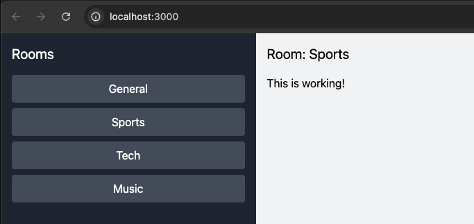

# Chat Application



This is a simple chat application built using Rust for the backend and React with TailwindCSS for the frontend. It allows users to join chat rooms and exchange messages in real time.

## Folder Structure
```
chat-app/
|-- backend/
|   |-- src/
|   |   |-- main.rs
|   |-- Cargo.toml
|-- frontend/
|   |-- src/
|   |   |-- components/
|   |   |   |-- ChatRoom.js
|   |   |   |-- RoomList.js
|   |   |-- App.js
|   |   |-- index.css
|   |   |-- index.js
|   |-- package.json
|-- README.md
```

## Backend Setup
1. Navigate to the backend directory:
   ```bash
   cd backend
   ```
2. Install Rust dependencies:
   ```bash
   cargo build
   ```
3. Run the server:
   ```bash
   cargo run
   ```

The server will start at `ws://127.0.0.1:3030/chat`.

## Frontend Setup
1. Navigate to the frontend directory:
   ```bash
   cd frontend
   ```
2. Install Node.js dependencies:
   ```bash
   npm install
   ```
3. Start the development server:
   ```bash
   npm start
   ```

The frontend will be available at `http://localhost:3000`.

## How to Use
1. Start the backend server.
2. Start the frontend server.
3. Open `http://localhost:3000` in your browser.
4. Select a chat room from the list and start chatting!
